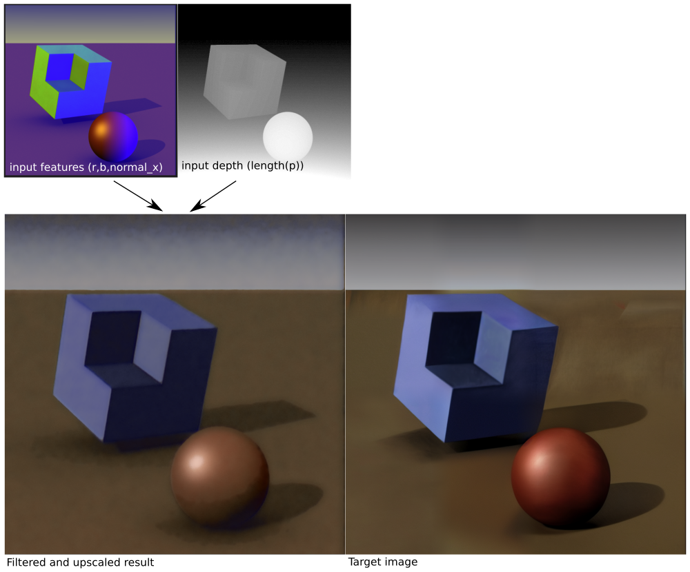
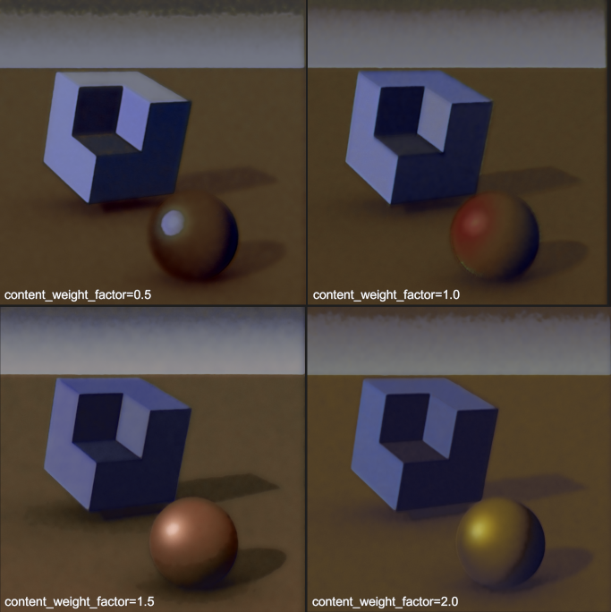

# Single Image Filtering with Neural Cellular Automata

An experiment with learned image filters for small GLSL shaders. Based on the [μNCA](https://arxiv.org/abs/2111.13545) model.

This repository is split into two parts:

- **renderer**, a Windows C++ OpenGL renderer, and
- **training**, a Jupyter notebook for training the filters with PyTorch.

Unfortunately the first runs only on Windows and the second one on Linux. I've used Windows 10 with WSL myself to run everything.

## How it works

Based on Alexander Mordvintsev and Eyvind Niklasson's research on neural cellular automata (NCA) published in these three papers:

- 2020 [Growing Neural Cellular Automata](https://distill.pub/2020/growing-ca/)
- 2021 [Self-Organising Textures](https://distill.pub/selforg/2021/textures/)
- 2021 [μNCA: Texture Generation with Ultra-Compact Neural Cellular Automata](https://arxiv.org/abs/2111.13545)

Both the model and the training objective have been modified for this experiment. The model is now running two smaller CAs in a row and starts from a "feature" image instead of pure noise. See the included notebook for more details.

I used four channel images to make it easier to implement on the C++ side. With more channels more elaborate textures can be generated, as shown in papers linked above.

The loss function is a combination of a "content" and "style" losses just like in style transfer tasks. Increasing the content loss weight makes results sharper but with less contrast:

### Is this better than the alternatives?

It may be possible to get similar results with a small convolutional neural network or a hand-tweaked bilateral filter.

## Creating your own filter

It's pretty arduous but all the pieces are there:

1. Export a raw .data image and a matching PNG with **renderer**
2. Crop the PNG to your liking and encode its x and y in the filename like `img_crop_x_y.png`.
3. Stylize your PNG in whatever way you wish.
4. Put the two files in training/images and add their paths to the notebook script.
5. Run the notebook and wait until it prints the GLSL code at the end.
6. Copy the GLSL snippets to `draw.frag` and `present.frag` in the renderer/blossom directory.
7. Compile & run the renderer project